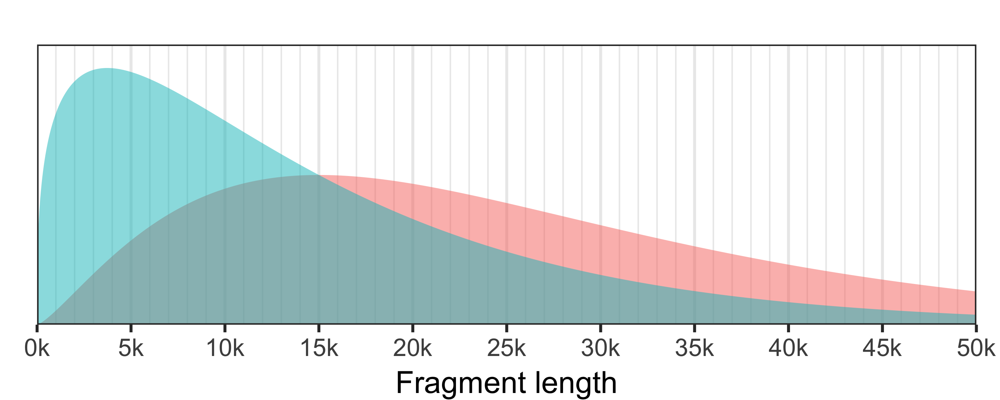
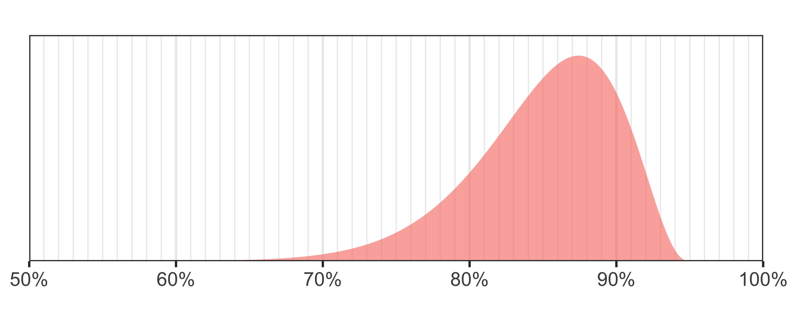

<p align="center"></p>

Badread is a long read simulator tool that makes – you guessed it – bad reads! It can imitate many kinds of problems one might encounter in real read sets: chimeric reads, low-quality regions, systematic basecalling errors and more.

Badread is pretty good at generating realistic simulated long read sets, but its focus is more on providing users with _control_ over the simulated reads. I made Badread for the purpose of testing long read assemblers. With it, one can increase the rate of different types of read problems, to see how they affect assembly quality.


## Table of contents

  * [Requirements](#requirements)
  * [Installation](#installation)
  * [Quick usage](#quick-usage)
  * [Method](#method)
  * [Detailed usage](#detailed-usage)
     * [Reference FASTA](#reference-fasta)
     * [Fragment lengths](#fragment-lengths)
     * [Read identities](#read-identities)
     * [Error model](#error-model)
     * [QScore model](#qscore-model)
     * [Adapters](#adapters)
     * [Junk and random reads](#junk-and-random-reads)
     * [Chimeras](#chimeras)
     * [Small plasmid bias](#small-plasmid-bias)
     * [Glitches](#glitches)
  * [License](#license)


## Requirements

Badread runs on MacOS and Linux. Its only dependencies are some Python packages ([Edlib](https://github.com/Martinsos/edlib/tree/master/bindings/python), [NumPy](http://www.numpy.org/), [SciPy](https://www.scipy.org/) and [Matplotlib](https://matplotlib.org/)) but these should be taken care of by pip when installing Badread.


## Installation

### Install from source

Running the `setup.py` script will install a `badread` executable:

```bash
git clone https://github.com/rrwick/Badread.git
cd Badread
python3 setup.py install
badread -h
```

* If the `python3 setup.py install` command complains about permissions, you may need to run it with `sudo`.
* Install just for your user: `python3 setup.py install --user`
    * If you get a strange 'can't combine user with prefix' error, read [this](http://stackoverflow.com/questions/4495120).
* Install to a specific location: `python3 setup.py install --prefix=$HOME/.local`
* Install with pip (local copy): `pip3 install path/to/Badread`
* Install with pip (from GitHub): `pip3 install git+https://github.com/rrwick/Badread.git`


### Run without installation

Badread can be run directly from its repository by using the `badread-runner.py` script, no installation required:

```bash
git clone https://github.com/rrwick/Badread.git
Badread/badread-runner.py -h
```

If you run Badread this way, it's up to you to make sure that all [necessary Python packages](#requirements) are installed.


## Quick usage

Badread's default settings correspond to Oxford Nanopore reads of mediocre-quality:
```
badread simulate --reference ref.fasta --quantity 50x \
    | gzip > reads.fastq.gz
```

Alternatively, you can use Badread's built-in models to imitate PacBio reads:
```
badread simulate --reference ref.fasta --quantity 50x --error_model pacbio --qscore_model pacbio \
    | gzip > reads.fastq.gz
```

To make very bad reads:
```
badread simulate --reference ref.fasta --quantity 50x --glitches 1000,100,100 \
    --junk_reads 5 --random_reads 5 --chimeras 10 --identity 75,90,8 \
    | gzip > reads.fastq.gz
```

To make very nice reads:
```
badread simulate --reference ref.fasta --quantity 50x --error_model random \
    --qscore_model ideal --glitches 0,0,0 --junk_reads 0 --random_reads 0 \
    --chimeras 0 --identity 95,100,4 --start_adapter_seq "" --end_adapter_seq "" \
    | gzip > reads.fastq.gz
```


## Method

Badread simulates reads by roughly following the process of sequencing real DNA: breaking the DNA into fragments, adding adapters and then reading the fragments into nucleotide sequences. Here is an overview of all the steps:

* Choose a length for a sequence fragment using the [fragment length distribution](#fragment-lengths).
* Choose a type of fragment:
  * Most will be fragments of sequence from the [reference FASTA](#reference-fasta). These are equally likely to come from either strand, and can loop around circular references.
  * Depending on the settings, some fragments may also be [junk or random sequence](#junk-and-random-reads).
* Add adapter sequences to the start and end of the fragment, based on the [adapter settings](#adapters). 
* As determined by the [chimera rate](#chimeras), there is a chance that Badread will make another fragment and concatenate it onto the current fragment (possibly with adapter sequences in between, possibly not).
* Add glitches to the fragment, based on the [glitch settings](#glitches).
* Choose a percent identity for the read using the [read identity distribution](#read-identities).
* 'Sequence' the fragment by adding errors to the sequence until it has the target percent identity.
  * Errors are added at random positions, leading to a somewhat variable identity across the span of the read.
  * Errors are chosen using the [error model](#error-model).
* Generate quality scores for each base using the [qscore model](#error-model).
* Output the read and quality in FASTQ format.
* Repeat until the total volume of reads reaches the target amount.


## Detailed usage

```
usage: badread simulate --reference REFERENCE --quantity QUANTITY [--length LENGTH]
                        [--identity IDENTITY] [--error_model ERROR_MODEL]
                        [--qscore_model QSCORE_MODEL] [--seed SEED] [--start_adapter START_ADAPTER]
                        [--end_adapter END_ADAPTER] [--start_adapter_seq START_ADAPTER_SEQ]
                        [--end_adapter_seq END_ADAPTER_SEQ] [--junk_reads JUNK_READS]
                        [--random_reads RANDOM_READS] [--chimeras CHIMERAS] [--glitches GLITCHES]
                        [--small_plasmid_bias] [-h] [--version]

Generate fake long reads

Required arguments:
  --reference REFERENCE           Reference FASTA file
  --quantity QUANTITY             Either an absolute value (e.g. 250M) or a relative depth (e.g. 25x)

Simulation parameters:
  Length and identity and error distributions

  --length LENGTH                 Fragment length distribution (mean and stdev, default: 15000,13000)
  --identity IDENTITY             Sequencing identity distribution (mean, max and stdev, default:
                                  85,95,5)
  --error_model ERROR_MODEL       Can be "nanopore", "pacbio", "random" or a model filename (default:
                                  nanopore)
  --qscore_model QSCORE_MODEL     Can be "nanopore", "pacbio", "random", "ideal" or a model filename
                                  (default: nanopore)
  --seed SEED                     Random number generator seed for deterministic output (default:
                                  different output each time)

Adapters:
  Controls adapter sequences on the start and end of reads

  --start_adapter START_ADAPTER   Adapter parameters for read starts (rate and amount, default: 90,60)
  --end_adapter END_ADAPTER       Adapter parameters for read ends (rate and amount, default: 50,20)
  --start_adapter_seq START_ADAPTER_SEQ
                                  Adapter sequence for read starts (default:
                                  AATGTACTTCGTTCAGTTACGTATTGCT)
  --end_adapter_seq END_ADAPTER_SEQ
                                  Adapter sequence for read ends (default: GCAATACGTAACTGAACGAAGT)

Problems:
  Ways reads can go wrong

  --junk_reads JUNK_READS         This percentage of reads will be low-complexity junk (default: 1)
  --random_reads RANDOM_READS     This percentage of reads will be random sequence (default: 1)
  --chimeras CHIMERAS             Percentage at which separate fragments join together (default: 1)
  --glitches GLITCHES             Read glitch parameters (rate, size and skip, default: 10000,25,25)
  --small_plasmid_bias            If set, then small circular plasmids are lost when the fragment
                                  length is too high (default: small plasmids are included regardless
                                  of fragment length)

Other:
  -h, --help                      Show this help message and exit
  --version                       Show program's version number and exit
```

### Reference FASTA

The reference genome must be given in FASTA format using the `--reference` argument.

Each sequence's depth can be specified in the FASTA header using `depth=1.1` or `depth=15`, etc. Badread will use this to determine the relative abundance of each sequence. This can be useful for both bacterial genomes (where plasmids may be higher depth than the chromosome) and eukaryote genomes (where chloroplast/mitochondrial genomes may be higher depth than the rest of the genome).

Circular sequences are indicated by including `circular=true` in the FASTA header. This allows reads to loop past the end and back to the start of the sequence.

For a couple of examples, check out [this page on the wiki](https://github.com/rrwick/Badread/wiki/Example-reference-FASTAs).


### Fragment lengths

Badread generates fragment lengths from a [gamma distribution](https://en.wikipedia.org/wiki/Gamma_distribution). Instead of providing the gamma distributions shape and rate (which are not very intuitive parameters), Badread defines the distribution using the mean and standard deviation.

Note that these parameters control the length of the _fragments_, not the final _reads_. These differ because: adapters are added to fragments, glitches can lengthen/shorten fragments, adding read errors can change the length (especially if the error model is biased towards insertions or deletions) and chimeras are made by concatenating multiple fragments together.

There are two ways to think about fragment lengths: the distribution of the fragment lengths and the distribution of the amount of bases in the fragments. The latter distribution is higher because larger fragments contribute more bases. The read N50 is the median of the base (red) distribution – half the bases will be in reads shorter than this and half in reads longer.

<table>
    <tr>
        <td>
            
            Badread's default is <code>--length 15000,13000</code> (mean=15000, stdev=13000) which corresponds to a decent Nanopore run (N50=22.6 kbp). The fragment length distribution is in blue, while the base distribution is in red.<br><br>
            You can interactively explore different values using <a href="https://www.desmos.com/calculator/xrkqgzt4o5">this Desmos plot</a>.
        </td>
    </tr>
</table>


### Read identities

Badread generates read identities from a [beta distribution](https://en.wikipedia.org/wiki/Beta_distribution). There are three parameters: `mean,max,stdev`. Max sets the upper end of the distribution. Stdev controls the shape: smaller values create a tighter distribution around the mean, while larger values make a broader distribution.

<table>
    <tr>
        <td>
            
            Badread's default is <code>--identity 85,95,5</code> which corresponds to a decent Nanopore sequencing run.<br><br>
            You can interactively explore different values using <a href="https://www.desmos.com/calculator/q7qw6rq2lb">this Desmos plot</a>.
        </td>
    </tr>
</table>

For detail on how Badread defines identity, check out [this page on the wiki](https://github.com/rrwick/Badread/wiki/Definition-of-identity).


### Error model

The possible values for the `--error_model` argument are:
* `nanopore`: a model trained on real Nanopore reads (the default)
* `pacbio`: a model trained on real PacBio reads
* `random`: a random error model with 1/3 chance each of insertion, deletion and substitution
* a filepath for a trained model

For more information on how error models work, see [this page on the wiki](https://github.com/rrwick/Badread/wiki/Error-models). For instructions on building your own error model, see [this page](https://github.com/rrwick/Badread/wiki/Generating-error-and-qscore-models).


### QScore model

The possible values for the `--qscore_model` argument are:
* `nanopore`: a model trained on real Nanopore reads (the default)
* `pacbio`: a model trained on real PacBio reads
* `random`: a model where qscores are meaningless and give no indication of read/base quality
* `ideal`: a model where scores are unrealistically informative about read/base quality

For more information on how qscore models work, see [this page on the wiki](https://github.com/rrwick/Badread/wiki/QScore-models). For instructions on building your own qscore model, see [this page](https://github.com/rrwick/Badread/wiki/Generating-error-and-qscore-models).


### Adapters

Adapter sequences are controlled with the `--start_adapter_seq` and `--end_adapter_seq` options. The default adapters are those for the Nanopore ligation adapters. To see what those sequences are and some alternatives, check out the [Adapter sequences page on the wiki](https://github.com/rrwick/Badread/wiki/Adapter-sequences).

How much adapter is added to the start/end of a read is controlled by two parameters: rate and amount. Rate is the percent chance that the adapter will appear at all. E.g. a start-adapter rate of 90 means that 10% of reads will have no adapter at their start and 90% of reads will have some adapter at their start. Think of it like a Bernoulli distribution.

Amount controls how much of the adapter, on average, appears on the read. E.g. a start-adapter rate of 60 means that when an adapter is on the start of the read, it has an expected length of 60% its full length. Start-adapters are truncated at the start and end-adapters are truncated at the end. The actual distribution of amount is controlled by a beta distribution, and you can interactively explore different values using [this Desmos plot](https://www.desmos.com/calculator/qzza86553k).

To turn off adapters entirely, set the sequences to nothing:<br>
`--start_adapter_seq "" --end_adapter_seq ""`


### Junk and random reads

Badread can add two types of completely wrong reads to the output: junk and random. Junk reads are low-complexity sequence and simulate something wrong with the sequencer. A junk fragment might look like `AATAATAATAATAATAATAATAATAAT` and so on. Random reads are made of random sequence and can serve to simulate external contamination. By default, Badread includes 1% of each type, so 2% of the total reads will be junk/random.


### Chimeras

Chimeric reads can occur in real datasets for two possible reasons: 1) fragments of DNA were actually ligated together before sequence (probably more common library preps that use ligase) and 2) more than one read was sequenced in quick succession such that the software didn't recognise them as separate (an in-silico chimera). They can occur on both PacBio and Nanopore sequencing platforms.

The `--chimeras` option controls the rate of fragment-joining in Badread. It takes a percentage, e.g. `--chimeras 5` means that 5% of the time a fragment will join with another. Chimeras of more than two can also happen, e.g. three fragments joined together – this becomes more common with higher chimera rates.


### Small plasmid bias

Small circular plasmids can be underrepresented in long read sequencing (a topic addressed in [Completing bacterial genome assemblies with multiplex MinION sequencing](http://mgen.microbiologyresearch.org/content/journal/mgen/10.1099/mgen.0.000132)).

Badread simulates this effect if you use the `--small_plasmid_bias` option. When turned on, Badread tosses out any fragment that lands in a circular reference which is smaller than the fragment size. The degree of bias is therefore strongly dependent on the fragment length distribution (specifically how much of the distribution is less than the plasmid's size). Note that this only affects _circular_ sequences – linear sequences are unaffected.


### Glitches

Glitches are points in the read where the sequence is briefly messed up. They are controlled by three parameters:
* rate: how often glitches occur
* size: how much random sequence is added to the read
* skip: how much read sequence is lost

These are specified with the `--glitches` option by giving all three parameters in a comma-delimited list (no spaces). E.g. `--glitches 5000,100,100`. Each of these parameters is a mean for a [geometric random variable](https://en.wikipedia.org/wiki/Geometric_distribution). E.g. a glitch rate of 1000 doesn't mean glitches occur at 1000 bp intervals, it means glitches are _on average_ 1000 bp apart. Turn glitches off entirely with `--glitches 0,0,0`.

Take a look at the [glitches page on the wiki](https://github.com/rrwick/Badread/wiki/Glitches) to see some dotplots which illustrate the concept.


## License

[GNU General Public License, version 3](https://www.gnu.org/licenses/gpl-3.0.html)
