<p align="center"></p>

Badread is a long read simulator tool that makes – you guessed it – bad reads! It can imitate many kinds of problems one might encounter in real read sets: chimeric reads, low-quality regions, systematic basecalling errors and more. You can use Badread to generate a realistic read set (with a normal amount of problems) or turn up the problems for a truly terrible read set. I made it for the purposes of testing long read assemblers. With it, one can see how different types of read problems affect assembly quality.


## Table of contents

  * [Requirements](#requirements)
  * [Installation](#installation)
  * [Quick usage](#quick-usage)
  * [Method](#method)
  * [Detailed usage](#detailed-usage)
     * [Reference FASTA](#reference-fasta)
     * [Fragment lengths](#fragment-lengths)
     * [Read identities](#read-identities)
     * [Error model](#error-model)
     * [Adapters](#adapters)
     * [Junk and random reads](#junk-and-random-reads)
     * [Chimeras](#chimeras)
     * [Small plasmid bias](#small-plasmid-bias)
     * [Glitches](#glitches)
  * [Other tools](#other-tools)
     * [Generating an error model](#generating-an-error-model)
     * [Visualising error rates in reads](#visualising-error-rates-in-reads)
  * [License](#license)


## Requirements

Badread runs on MacOS and Linux. Its only dependencies are some Python packages ([Edlib](https://github.com/Martinsos/edlib/tree/master/bindings/python), [NumPy](http://www.numpy.org/), [SciPy](https://www.scipy.org/) and [Matplotlib](https://matplotlib.org/)) but these should be taken care of by pip when installing Badread.


## Installation

### Install from source

Running the `setup.py` script will install a `badread` executable:

```bash
git clone https://github.com/rrwick/Badread.git
cd Badread
python3 setup.py install
badread -h
```

* If the `python3 setup.py install` command complains about permissions, you may need to run it with `sudo`.
* Install just for your user: `python3 setup.py install --user`
    * If you get a strange 'can't combine user with prefix' error, read [this](http://stackoverflow.com/questions/4495120).
* Install to a specific location: `python3 setup.py install --prefix=$HOME/.local`
* Install with pip (local copy): `pip3 install path/to/Badread`
* Install with pip (from GitHub): `pip3 install git+https://github.com/rrwick/Badread.git`


### Run without installation

Badread can be run directly from its repository by using the `badread-runner.py` script, no installation required:

```bash
git clone https://github.com/rrwick/Badread.git
Badread/badread-runner.py -h
```

If you run Badread this way, it's up to you to make sure that all [necessary Python packages](#requirements) are installed.


## Quick usage

__Generate fake Nanopore reads at 50x depth:__
```
badread simulate --reference ref.fasta --quantity 50x --error_model nanopore_7-mer_model | gzip > reads.fastq.gz
```

__Generate 200 Mbp of fake PacBio reads:__
```
badread simulate --reference ref.fasta --quantity 200M --error_model pacbio_7-mer_model | gzip > reads.fastq.gz
```

__Generate very bad fake reads:__
```
badread simulate --reference ref.fasta --quantity 50x --error_model nanopore_7-mer_model --glitches 1000,100,100 --junk_reads 5 --random_reads 5 --chimeras 10 --identity 75,90,3.5 | gzip > reads.fastq.gz
```

__Generate very nice fake reads:__
```
badread simulate --reference ref.fasta --quantity 50x --error_model random --glitches 0,0,0 --junk_reads 0 --random_reads 0 --chimeras 0 --identity 95,100,4 --start_adapter 0,0 --end_adapter 0,0 | gzip > reads.fastq.gz
```


## Method

Badread simulates reads by roughly following the process of sequencing real DNA: breaking the DNA into fragments, adding adapters and then reading the fragments into nucleotide sequences.

Here is an overview of all the steps in Badread's read-generation:
* Choose a length for a sequence fragment using the [fragment length distribution](#fragment-lengths).
* Choose a type of fragment:
  * Most will be fragments of sequence from the [reference FASTA](#reference-fasta). These are equally likely to come from either strand, and can loop around circular references.
  * Depending on the settings, some fragments may also be [junk or random sequence](#junk-and-random-reads).
* Add adapter sequences to the start and end of the fragment, based on the [adapter settings](#adapters). 
* As determined by the [chimera setting](#chimeras), there is a chance that Badread will make another fragment and concatenate it onto the current fragment (possibly with adapter sequences in between, possibly not).
* Add glitches to the fragment, based on the [glitch settings](#glitches).
* Choose a percent identity for the read using the [read identity distribution](#read-identities).
* 'Sequence' the fragment by adding errors to the sequence until it has the target percent identity.
  * Errors are added at random positions, leading to a somewhat variable identity across the span of the read.
  * Errors are chosen using the [error model](#error-model).
* Generate quality scores for each base using the [qscore model](#error-model).
* Output the finished read, and repeat until the total volume of reads reaches the target amount.


## Detailed usage

### Reference FASTA

The reference genome must be given in FASTA format using the `--reference` argument.

Each sequence's depth can be specified in the FASTA header using `depth=1.1` or `depth=15`, etc. Badread will use this to determine the relative abundance of each sequence. This can be useful for both bacterial genomes (where plasmids may be higher depth than the chromosome) and eukaryote genomes (where chloroplast/mitochondrial genomes may be higher depth than the rest of the genome).

Circular sequences are indicated by including `circular=true` in the FASTA header. This allows reads to loop past the end and back to the start of the sequence.

An example bacterial genome reference FASTA might look like this:
```
>chromosome depth=1.0 circular=true
GTGTCACTTTCGCTTTGGCAGCAGTGTCTTGCCCGATTGCAGGATGAGTTACCAGCCACAGAATTCAGCA
...
>plasmid depth=1.3 circular=true
ATGACGAGCGAAAATAACAGCTTACTTCTGAACCTTCAGGAAGTTGATAAGACAACCGGCGAAGTTGTTA
...
```

An example eukaryote genome reference FASTA might look like this:
```
>chromosome_I depth=1.0
CCACACCACACCCACACACCCACACACCACACCACACACCACACCACACCCACACACACACATCCTAACA
...
>chromosome_II depth=1.0
AAATAGCCCTCATGTACGTCTCCTCCAAGCCCTGTTGTCTCTTACCCGGATGTTCAACCAAAAGCTACTT
...
>chromosome_III depth=1.0
CCCACACACCACACCCACACCACACCCACACACCACACACACCACACCCACACACCCACACCACACCACA
...
...
...
>mitochondria depth=100.0 circular=true
TTCATAATTAATTTTTTATATATATATTATATTATAATATTAATTTATATTATAAAAATAATATTTATTA
...
```


### Fragment lengths

Badread generates fragment lengths from a [gamma distribution](https://en.wikipedia.org/wiki/Gamma_distribution). Instead of providing the gamma distributions shape and rate (which are not very intuitive paramaters), Badread defines the distribution using the mean and standard deviation.

Note that these parameters control the length of the _fragments_, not the final _reads_. These differ because: adapters are added to fragments, glitches can lengthen/shorten fragments, adding read errors can change the length (especially if the error model is biased towards insertions or deletions) and chimeras are made by concatenating multiple fragments together.

There are two ways to think about fragment lengths, and the plots below show both: the distribution of the fragment lengths (blue) and the distribution of the amount of bases in the fragments (red). The latter distribution is higher because larger fragments contribute more bases. The read N50 is the median of the base (red) distribution – half the bases will be in reads shorter than this and half in reads longer.

<table>
    <tr>
        <td>
            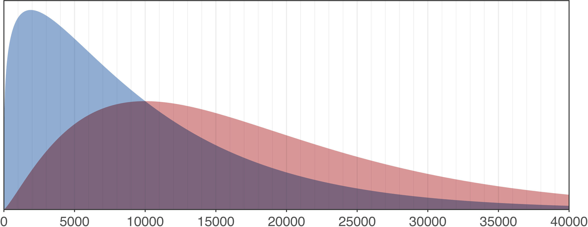
            Badread's default is <code>--length 10000,9000</code> (mean=10000, stdev=9000) which corresponds to a typical decent long-read sequencing run (N50=15.5 kbp).
        </td>
    </tr>
</table>

<table>
    <tr>
        <td>
            
            Using <code>--length 2000,2000</code> (mean=2000, stdev=2000) will give a shorter read distribution (N50=3.3 kbp) corresponding to a not-so-great sequencing run.
        </td>
    </tr>
</table>

<table>
    <tr>
        <td>
            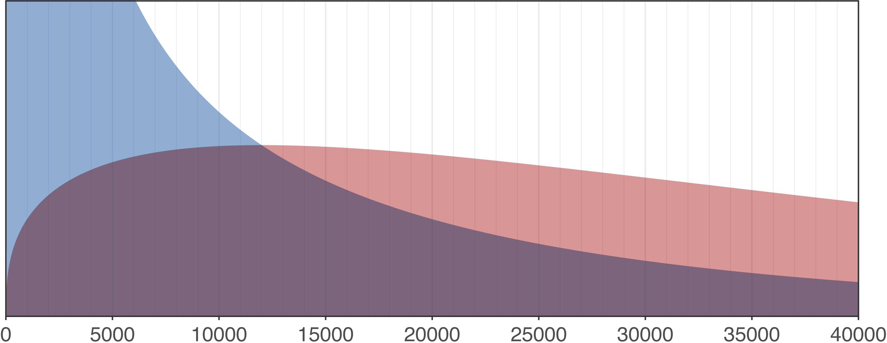
            Using <code>--length 12000,20000</code> (mean=2000, stdev=2000) will give a longer read distribution (N50=34.8 kbp) corresponding to a very nice sequencing run.
        </td>
    </tr>
</table>

You can interactively explore different values using [this Desmos plot](https://www.desmos.com/calculator/yaexntzlha).


### Read identities

#### Definition of identity

Badread defines identity the same way as BLAST does: the number of matching bases over the length of the alignment. Take this example of a 24 bp read which originated from a 24 bp fragment of DNA. The read has 3 errors: one deletion, one substitution and one insertion. This read's identity is 22 / 25 = 88%. Note that the denominator is the not the length of the _read_ but rather the length of the _alignment_.

```
             Read:  ACGAC-CAGCAGTCGCGACTAGCTT
                    ||||| |||||| || |||||||||
Original sequence:  ACGACTCAGCAGACG-GACTAGCTT
```

Since DNA has only a 4 letter alphabet, two completely random sequences can typically align with >50% identity. As an example, here are two random sequences aligned to each other:
```
AAT-CGGCGCGTCCCGCGTTTCGGAAATTGA-C-ACTCTGACG-GTT---AGCACAG--
| | ||| | | |  || ||  ||   | || | | | ||| | |||   || | ||  
ATTACGG-GAG-C--GC-TTA-GGC--T-GAACTATTATGATGCGTTGCGAGAAAAGGA
```
They match in 32 places over 59 alignment positions, giving an identity of 54%. This means that any read with less than about 60% identity is difficult to distinguish from random sequence.


#### Badread identity distributions

Badread generates read identities from a [beta distribution](https://en.wikipedia.org/wiki/Beta_distribution). There are three parameters: `mean,max,shape`. Max sets the upper end of the distribution. Shape controls the variance: larger values create a tighter distribution around the mean, while smaller values make a broader distribution.

<table>
    <tr>
        <td>
            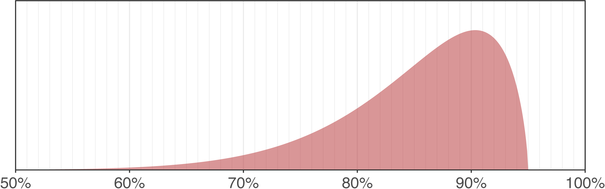
            Badread's default is <code>--identity 85,95,4</code> which corresponds to a typical decent Nanopore sequencing run.
        </td>
    </tr>
</table>

<table>
    <tr>
        <td>
            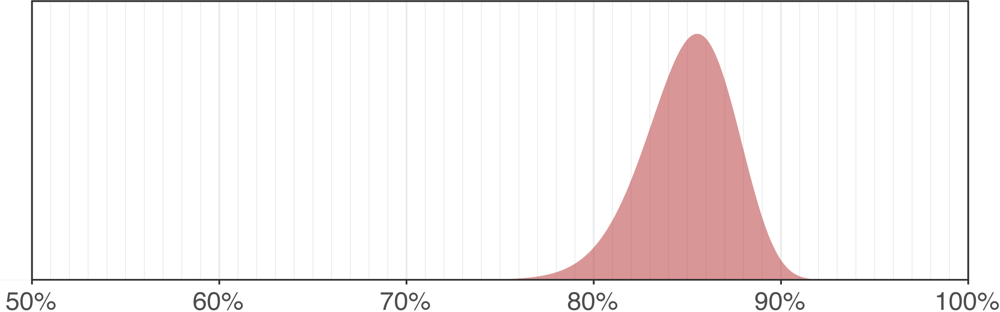
            Increasing the shape parameter (<code>--identity 85,95,12</code>) results in a tighter distribution around the mean – fewer very good and very bad reads.
        </td>
    </tr>
</table>

<table>
    <tr>
        <td>
            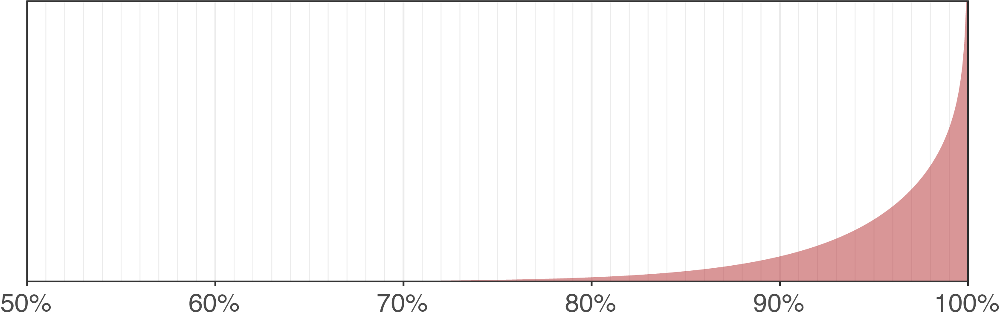
            Increase the mean and max (<code>--identity 95,100,4</code>) to simulate a very high quality (unrealistically so) read set.
        </td>
    </tr>
</table>

<table>
    <tr>
        <td>
            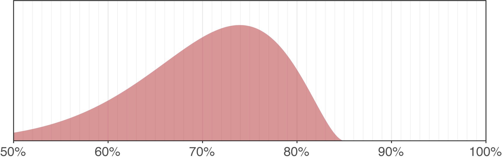
            A low mean and max (<code>--identity 70,85,4</code>) results in very poor reads (like what you might have encountered in the [early days of Nanopore sequencing](http://nextgenseek.com/2014/06/behold-oxford-nanopore-reads-are-here/))
        </td>
    </tr>
</table>

You can interactively explore different values using [this Desmos plot](https://www.desmos.com/calculator/iehjnd6s84).


### Error model


### Adapters

The default values are those for the Nanopore ligation adapters:
```
--start_adapter_seq AATGTACTTCGTTCAGTTACGTATTGCT --end_adapter_seq GCAATACGTAACTGAACGAAGT
```

Alternatives include:

* a barcoded Nanopore adapter:
```
--start_adapter_seq AATGTACTTCGTTCAGTTACGTATTGCTAAGGTTAACACAAAGACACCGACAACTTTCTTCAGCACCT --end_adapter_seq AGGTGCTGAAGAAAGTTGTCGGTGTCTTTGTGTTAACCTTAGCAATACGTAACTGAACGAAGT
```

* the Nanopore rapid adapter:
```
--start_adapter_seq GTTTTCGCATTTATCGTGAAACGCTTTCGCGTTTTTCGTGCGCCGCTTCA --end_adapter_seq ""
```
* a barcoded Nanopore rapid adapter:
```
--start_adapter_seq AATGTACTTCGTTCAGTTACGGCTTGGGTGTTTAACCAAGAAAGTTGTCGGTGTCTTTGTGGTTTTCGCATTTATCGTGAAACGCTTTCGCGTTTTTCGTGCGCCGCTTCA --end_adapter_seq ""
```

Or anything else you want to put on your reads!


### Junk and random reads

Badread can add two types of completely wrong reads to the output: junk and random. Junk reads are low-complexity sequence and simulate something wrong with the sequencer. A junk fragment might look like `AATAATAATAATAATAATAATAATAAT` and so on. Random reads are made of random sequence and can serve to simulate external contamination. By default, Badread includes 1% of each type, so 2% of the total reads will be junk/random.


### Chimeras

Chimeric reads can occur in real datasets for two possible reasons: 1) fragments of DNA were actually ligated together before sequence (probably more common library preps that use ligase) and 2) more than one read was sequenced in quick succession such that the software didn't recognise them as separate (an in-silico chimera). They can occur on both PacBio and Nanopore sequencing platforms.

The `--chimeras` option controls the rate of fragment-joining in Badread. It takes a percentage, e.g. `--chimeras 5` means that 5% of reads will be made of multiple separate fragments.


### Small plasmid bias

Small circular plasmids can be underrepresented in long read sequencing (a topic addressed in [Completing bacterial genome assemblies with multiplex MinION sequencing](http://mgen.microbiologyresearch.org/content/journal/mgen/10.1099/mgen.0.000132)). The most straightforward explanation is that circular DNA is unavailable for sequencing because it has no free ends on which adapters can ligate.

Badread simulates this effect if you use the `--small_plasmid_bias` option. When turned on, Badread tosses out any fragment that lands in a circular reference which is smaller than the fragment size. The degree of bias is therefore strongly dependent on the fragment length distribution (specifically how much of the distribution is less than the plasmid's size). Note that this only affects _circular_ sequences – linear sequences are unaffected.


### Glitches

Glitches are points in the read where the sequence is briefly messed up. They are controlled by three parameters:
* glitch rate: how often glitches occur
* glitch size: how much random sequence is added to the read
* glitch skip: how much read sequence is lost

These are specified with the `--glitches` option by giving all three parameters in a comma-delimited list (no spaces). E.g. `--glitches 5000,100,100`. Each of these parameters is a mean for a [geometric random variable](https://en.wikipedia.org/wiki/Geometric_distribution). E.g. a glitch rate of 1000 doesn't mean glitches occur at 1000 bp intervals, it means glitches are _on average_ 1000 bp apart.

To better understand glitches, let's look at some dotplots comparing a sequence in Badread before glitches are added on the x axis and after glitches (but before sequencing errors) on the y axis:

| 5000,100,100 | 1000,100,100 | 200,100,100 |
| --- | --- | --- |
| 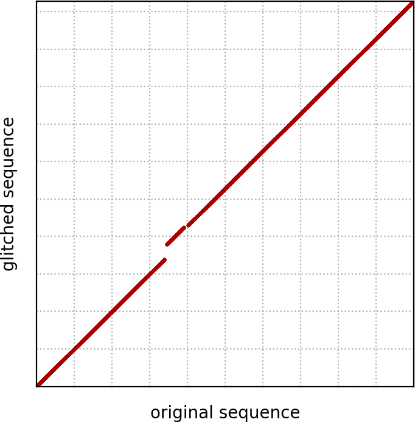 | 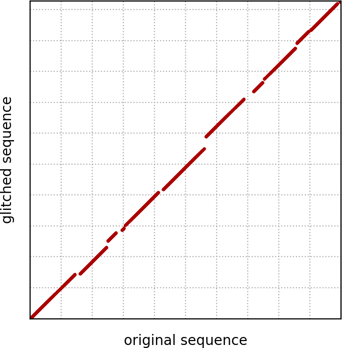 | 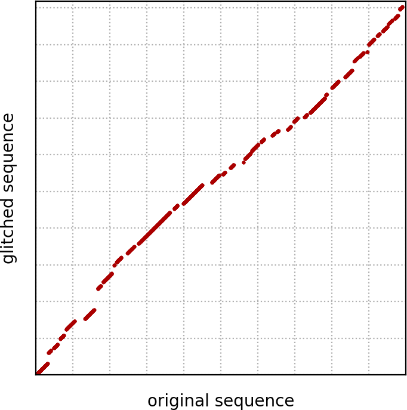 |

The three dotplots above show 10 kbp reads where the glitch rate is varied. You can see that the smaller the value, the smaller the space between glitches.

| 1000,100,0 | 1000,0,100 | 1000,100,100 |
| --- | --- | --- |
| 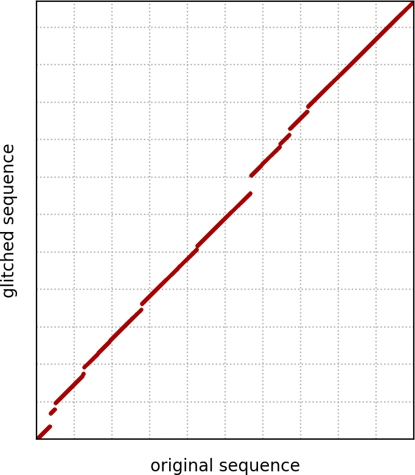 | 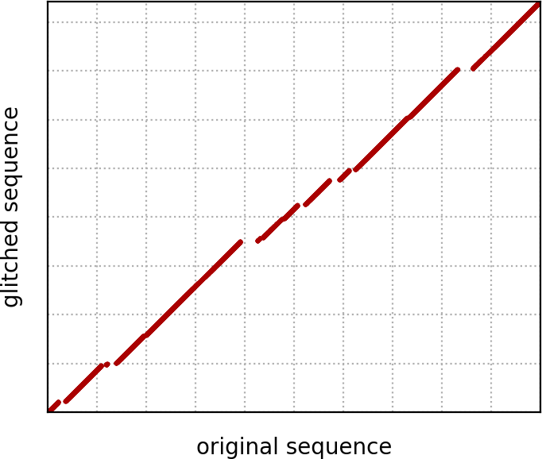 |  |

These dotplots show the effect of the size and skip parameters. The first has a size of 100 and a skip of 0. This means that each glitch adds random sequence but loses no real sequence, resulting in a longer glitched sequence. The second is the opposite, a size of 0 and a skip of 100, where the glitched sequence is shorter than the original. The third has size and skip both equal to 100, so the glitched sequence should on average be the same length as the original.

The examples shown above are particularly glitchy to illustrate the concept. Badread's default value is `5000,50,50` for a modest amount of glitches. Or you can use `0,0,0` to turn glitches off entirely:

| 5000,50,50 | 0,0,0 |
| --- | --- |
| 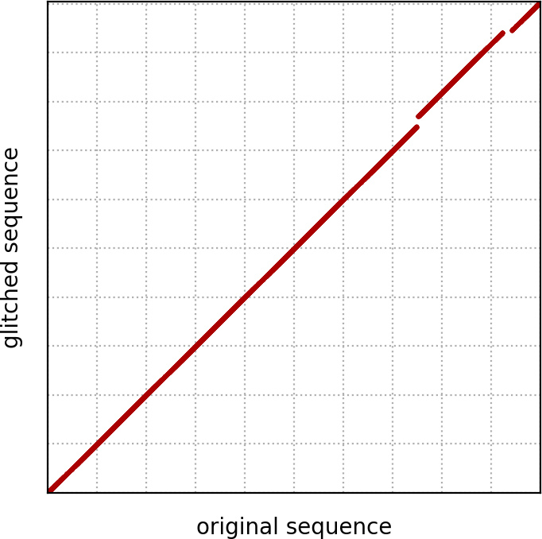 | 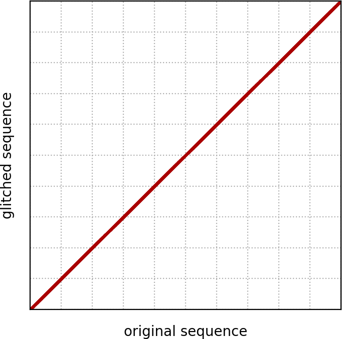 |


## Other tools

Badread comes with some other functionality, in addition to its main read-generation.


### Generating an error model


### Visualising error rates in reads


## License

[GNU General Public License, version 3](https://www.gnu.org/licenses/gpl-3.0.html)
