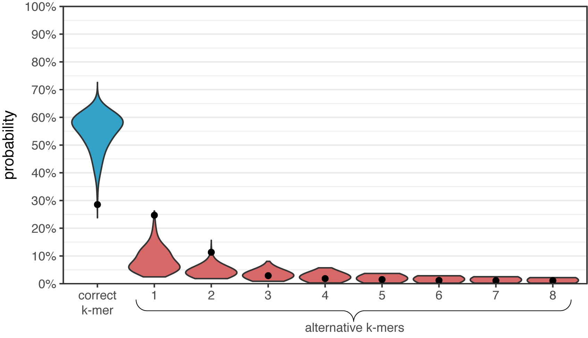
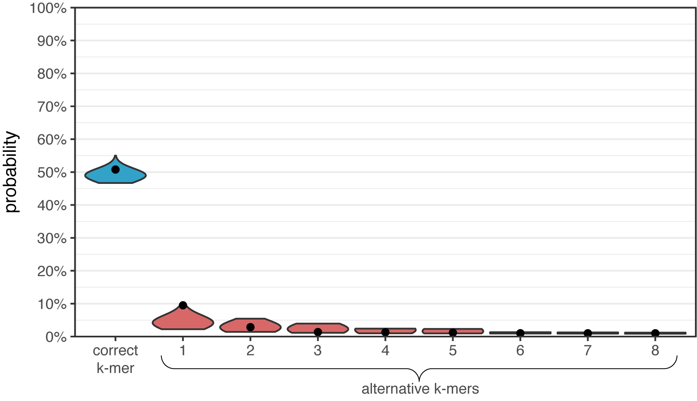

# Badread error models

  * [File format](#file-format)
  * [How they are used](#how-they-are-used)
  * [Plots](#plots)


## File format

This directory contains the built-in error models that come with Badread. These files are sort of human readable (if you unzip them).

To understand their format, let's look at a single line from one:
```
ACAGTTG,0.670537;ACGGTTG,0.126679;ACCAGTTG,0.014125;ACGGATTG,0.011513;ACGGTG,0.010676;ACAGTTTG,0.009899;ACGTTG,0.008825;AGTTG,0.007245;ACGAGTTG,0.006659;ACGAAGTTG,0.004242;ACCGGTTG,0.003894;ACGATTG,0.003300;ACAGTTAG,0.003126;AGCAGTTG,0.002820;ACG,0.002501;ACAATTG,0.002446;ATTG,0.002382;ACAGTG,0.002357;ACGATTTG,0.002179;ACCCAGTTG,0.002111;ACGGATTTG,0.002094;ACGGTTTG,0.001945;ACAGGTTG,0.001920;ACGGTTAG,0.001907;AAGTTG,0.001898;ACGGATG,0.001886;
```

This line describes the k-mer ACAGTTG, and you can see it right at the start. What follows is the probability that this k-mer will be correctly sequenced: 67% in this case. Subsequence parts of the line show alternatives and their probabilities. I.e. if this k-mer is _not_ sequenced correctly, what form might it take and what are the chances of each.

Here is the information in tabular form:

| K-mer      | Probability | Notes                          |
| :--------- | ----------: | :----------------------------- |
| `ACAGTTG`  | 67.0537%    | correct (no errors)            |
| `ACGGTTG`  | 12.6679%    | most common alternative        |
| `ACCAGTTG` | 1.4125%     | second-most common alternative |
| `ACGGATTG` | 1.1513%     | third-most common alternative  |
| `ACGGTG`   | 1.0676%     | fourth-most common alternative |

...and so on.

You can think of each line as a [discrete random variable](https://en.wikipedia.org/wiki/Random_variable#Discrete_random_variable). The number of alternatives can be set when building an error model. I used 25 alternatives for these, so there are up to 26 values (when the correct k-mer is included). The probabilities should sum up to a value less than or equal to one (sums of less than one occur because the alternative lists are truncated at 25).

These models can be built with any k-mer size, but I've used 7-mers for the ones included with Badread. That means that the files contain one line for each possible 7-mer (AAAAAAA to TTTTTTT), 16384 in total.


## How they are used

When Badread is generating a fake read, it follows this process:
* Choose a random k-mer in the sequence.
* Use that k-mer's line in the error model to draw a new k-mer. This may be the correct k-mer (matching the k-mer we started with) or an error-containing alternative.
* Replace the sequence's k-mer with the new k-mer.
* Repeat until the sequence's percent identity is low enough.

This stochastic approach has two delibrate consequences:
* The read accumulates errors in an uneven manner, with some parts of the read ending up with higher accuracy and other parts with lower accuracy.
* Since the correct k-mer is included in the random draw, some k-mers in the read are more likely to obtain errors than others.


## Plots

### Nanopore model

Here is a violin plot of the first eight alternatives for each k-mer in the Nanopore model. Each distribution contains 16384 points, and the dot shows an interesting k-mer: TCCCCCA.

<p align="center"></p>

TCCCCCA is a particular bad k-mer, as it has only a 7.4% chance of being correct. Its first alternative (TCCCCA, deletion of a C) is much more likely at 63.7%. However, from the distribution you can see that other k-mers have almost a 90% chance of being correct. This illustrates the problem of systematic error in Nanopore reads – it is better at sequencing some k-mers than others. Homopolymers (like was shown in TCCCCCA) are a particular issue.


### PacBio model

<p align="center"></p>

The PacBio model has smaller distributions. Most importantly, the correct k-mer distribution does not extend as low and the alternative k-mer distributions don't extend as high. PacBio sequencing also struggles with homopolymers (you can see that TCCCCCA still performs relatively poorly), but not as much as Nanopore.

This error model is closer to being random: where errors occur irrespective of their contextual sequence. Random errors are better because they are easy to correct with higher sequencing depth.


### Random model

This directory does _not_ contain a model file for random errors. It's not necessary, as Badread can easily produce random errors without a probabilistic model. But for the sake of comparison, I used Badread's random-error reads to generate an error model so I could make a plot like those above.

<p align="center"></p>

Here, pretty much all k-mers (even a homopolymer like TCCCCCA) have the same probability of being correct. This is an ideal situation for assembly, as no systematic errors will creep into the final consensus sequence.
