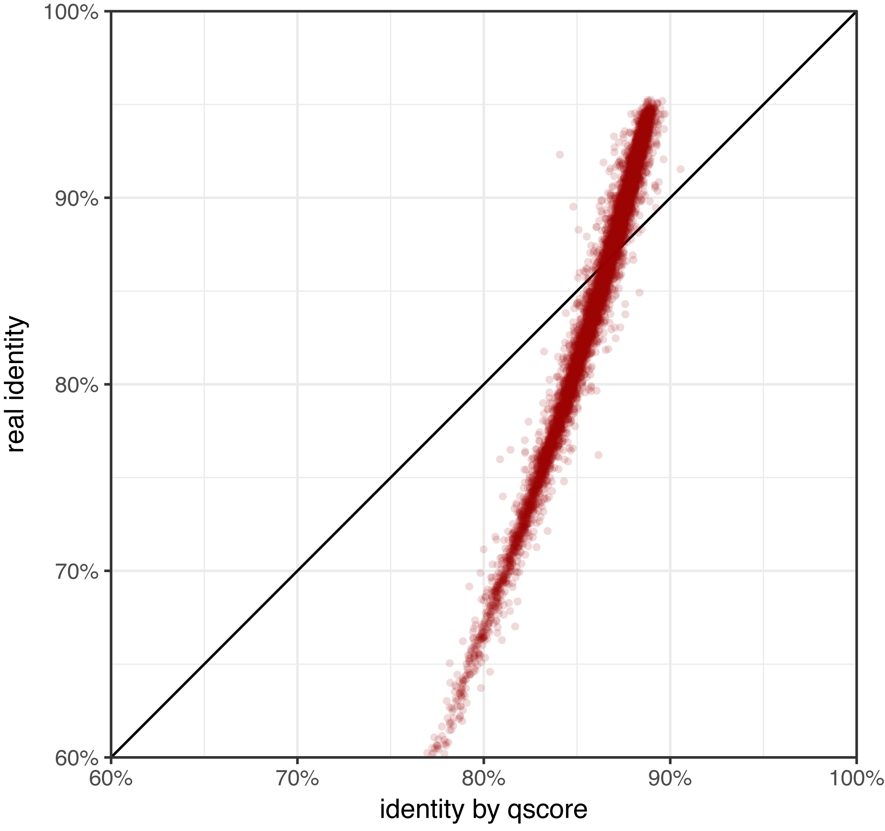
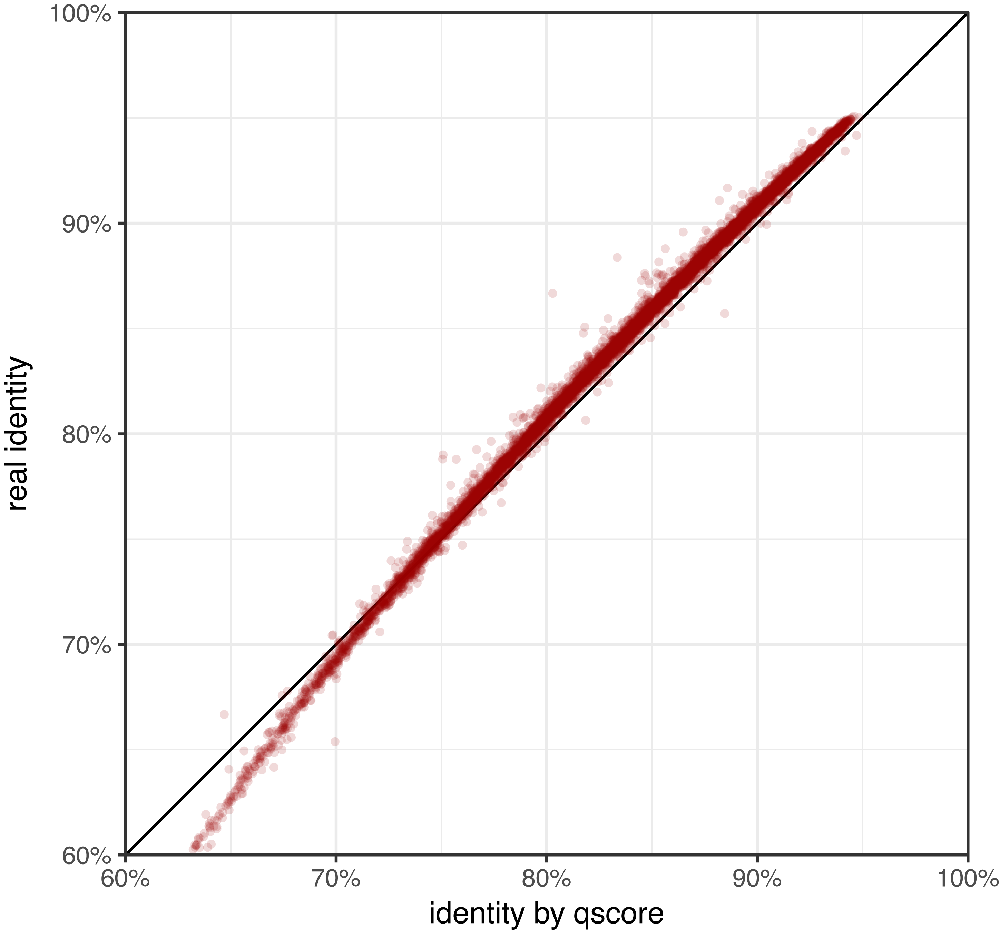

# Badread qscore models

  * [File format](#file-format)
  * [How they are used](#how-they-are-used)
  * [Plots](#plots)


## File format

Badread's qscore models describe the probability distribution of [Phred quality scores](https://www.drive5.com/usearch/manual/quality_score.html).

The first line of the file describes the overall qscore distribution of the training data:
```
overall;119428314;1:0.000065,2:0.002683,3:0.011969,4:0.022982,5:0.03079,6:0.036889,7:0.042461,8:0.047495,9:0.051971,10:0.055876,11:0.058956,12:0.0606,13:0.060621,14:0.059446,15:0.056487,16:0.052028,17:0.047379,18:0.043445,19:0.040219,20:0.037767,21:0.035767,22:0.033816,23:0.031369,24:0.027969,25:0.023457,26:0.018417,27:0.008983,28:0.000093,
```

This line says that there were 119,428,314 qscores examined in the training data, and their distribution was:

| Qscore | ASCII | Probability |
| :----- | :---- | ----------: |
| 1      | `!`   | 0.0065%     |
| 2      | `"`   | 0.2683%     |
| 3      | `#`   | 1.1969%     |
| 4      | `$`   | 0.022982%   |
| 5      | `#`   | 0.03079%    |
| 6      | `'`   | 3.6889%     |

...and so on.

The remaining lines of the file describe the qscore distribution around particular types of sequence alignment, as described by CIGAR strings.

As an example, consider this long read and the corresponding DNA fragment it came from:
```
Read:              ATTACTGCTCGTTCGATTACATATTGCTTCGGCTGCGGCTCAGCCGCCACGTGGGTCTAGCGATTAACA
Original fragment: ATTGCACTACTTCGTTCAGTTACGTATTGCTTCGGCTGCGGCTCCGCCGCCAGCGGATTGGTGTCCATGGCGTTAACA
```

Their alignment can be described with the following CIGAR string:
```
3=2D3=1X2=1D5=1D1=1I4=1X20=1X7=1D2=2D1=1D2=1D3=1X1=1D1=1D2=1I6=
```

And to make it more clear, here are the aligned sequences with the expanded CIGAR:
```
Read:              ATT--ACTGCT-CGTTC-GATTACATATTGCTTCGGCTGCGGCTCAGCCGCCA-CG--T-GG-GTCTA-G-CGATTAACA
CIGAR:             ===DD===X==D=====D=I====X====================X=======D==DD=D==D===X=D=D==I======
Original fragment: ATTGCACTACTTCGTTCAG-TTACGTATTGCTTCGGCTGCGGCTCCGCCGCCAGCGGATTGGTGTCCATGGCG-TTAACA
```

Now for any base in the read, we can use the CIGAR to see how good the read looks in that base's neighbourhood. Using the fifth C in the read as an example, we can see that it matches, but it's adjacent to a mismatch and a bit downstream from an insertion:
```
                                          *
Read:              ATT--ACTGCT-CGTTC-GATTACATATTGCTTCGGCTGCGGCTCAGCCGCCA-CG--T-GG-GTCTA-G-CGATTAACA
CIGAR:                                I====X===
Original fragment: ATTGCACTACTTCGTTCAG-TTACGTATTGCTTCGGCTGCGGCTCCGCCGCCAGCGGATTGGTGTCCATGGCG-TTAACA
```

The qscore model file describes one such CIGAR alignment per line. Each line has the CIGAR, followed by the number of times that CIGAR was seen in the training data, followed by the distribution of qscores seen at that CIGAR:
```
I====X===;13148;1:0.000076,2:0.00327,3:0.014147,4:0.034226,5:0.053392,6:0.066246,7:0.078339,8:0.078491,9:0.085032,10:0.082446,11:0.078111,12:0.066854,13:0.063356,14:0.053772,15:0.040006,16:0.036431,17:0.033541,18:0.027989,19:0.020992,20:0.019851,21:0.019319,22:0.015364,23:0.012017,24:0.008442,25:0.005476,26:0.002282,27:0.000532,
```

You can think of it as a [discrete random variable](https://en.wikipedia.org/wiki/Random_variable#Discrete_random_variable) of qscores for the middle position of the `I====X===` alignment. All CIGARs in the qscore model are an odd length (with respect to the read, deletions don't count toward the length) so there is always a defined middle position.


## How they are used

After Badread generates the sequence for a fake read, it makes the qscores as follows:
* Align the read sequence back to the original (i.e. error-free) fragment and generate a CIGAR.
* For each base in the read:
  * Get the local CIGAR: the bit of alignment where this base is at the centre.
  * Use the qscore model to get the distribution for that CIGAR, and draw the qscore from that random variable.
  * If the local CIGAR is not in the model (e.g. `==D==DD=D==D==` describes nine bases of the read but is not in the Nanopore error model), trim it down until we find a CIGAR that is in the model (e.g. `==DD=D==` describes 5 bases and is in the model).


## Plots

Here I show two different kinds of plots to illustrate the qscore models. The first kind is qscore distribution for a few select CIGARs. Specifically, each shows the qscore distribution for the base in the centre of the CIGAR:
* `=========`: a 9-mer exact match: the base is correct and it's in a good region.
  * E.g. the `C` in `AGGTCGGTA` where the read and reference agree.
* `=====D====`: a match next to a deletion: the base is correct but its neighbour (to the right) is missing.
  * Deletions are tough with qscores, because the deleted base is not present in the read to receive a qscore itself, so here we look at the qscore of the base _next_ to the deletion.
  * E.g. the `G` in `AACAGAACC` where the actual sequence is `AACAGTAACC` (the `T` was deleted).
* `====I====`: an insertion: the base is a false addition to the sequence.
  * E.g. the `A` in `CTCGACTCG` where the actual sequence is `CTCGCTCG` (the `A` was inserted).
* `====X====`: a mismatch: the base in the central position is incorrect.
  * E.g. the `T` in `ACGATGACG` where the actual sequence is `ACGACGACG` (the `T` is an error and should be `C`).

The second kind of plot is read identity as predicted by qscore vs real read identity. This gives a measure of how much you can use the qscores to estimate a read's accuracy. I get the predicted identity by [averaging the probability of error at each position](https://gigabaseorgigabyte.wordpress.com/2017/06/26/averaging-basecall-quality-scores-the-right-way/). Again, this is a bit tricky when in comes to deletions in reads, because deleted bases don't have qscores, so we rely on neighbouring qscores to indicate deletions.


### Nanopore model

These plots show the qscore distribution for a few select CIGARs. Specifically, each shows the qscore distribution for the base in the centre of the CIGAR. The mean qscore for each is indicated with a vertical line:

<table>
    <tr>
        <td>
            
            As you would expect, the 9-mer match (top-left) has the highest mean (indicated with a vertical line) of all CIGARs shown in this plot. The match next to the deletion (top-right) is a bit lower, showing that deletions do affect neighbouring base qscores. The insertion and mismatch CIGARs (bottom row) have the lowest qscores.
        </td>
    </tr>
</table>

<table>
    <tr>
        <td>
            
            You can see that the Nanopore qscore model is a perfectly good <em>relative</em> measure of read identity (lower average qscores indicate lower identity reads and vice versa) but not a very good <em>absolute</em> measure. In general, the identity estimated by the qscores is overly optimistic.
        </td>
    </tr>
</table>


### PacBio model

<table>
    <tr>
        <td>
            
            The trends for the PacBio qscore model are largely the same as those for the Nanopore model (the 9-mer match has the highest mean qscore and the mismatch CIGAR has the lowest) but the shapes of each distributions is quite different. Interestingly, PacBio qscores only go up to 15 wheras the Nanopore qscores go up to 28.
        </td>
    </tr>
</table>

<table>
    <tr>
        <td>
            
            This plot looks quite similar to corresponding one for the Nanopore model: good relative measure of read identity but poor absolute measure. The qscore overestimates identity for bad reads and underestimates for good reads.
        </td>
    </tr>
</table>


### Random model

If you run Badread with `--qscore_model random`, it will assign a random qscore to each base from a uniform distribution of 1–20. This model is _not_ included as a file in this directory (it is hard-coded into Badread), but for the sake of illustration, I generated a model from Badread's random qscore reads and used it to generate these plots:

<table>
    <tr>
        <td>
            
            As you can see, with the random qscore model, all bases look the same, regardless of their CIGAR. The qscores therefore tell us nothing about the quality of a base and are essentially useless.
        </td>
    </tr>
</table>

<table>
    <tr>
        <td>
            
            This uselessness is also reflected in the actual identity vs predicted identity plot. The qscores give no information about a read's identity.
        </td>
    </tr>
</table>


### Ideal model

To contrast with the random qscore model, Badread also has a hard-coded ideal model (`--qscore_model ideal`):

<table>
    <tr>
        <td>
            
            This model is unrealistically informative and represents what qscores would tell us in an ideal world. In the Nanopore/PacBio models, a high qscore means that a base is <em>likely</em> to be good, but bad bases sometimes get high qscores too. In this model, a high qscore nearly guarantees that the base is good.
        </td>
    </tr>
</table>

<table>
    <tr>
        <td>
            
            I also tried to tune the scores such that the qscore-predicted identity matched the actual read identity. The relationship isn't perfect, but it's a lot better than the other qscore models.
        </td>
    </tr>
</table>
