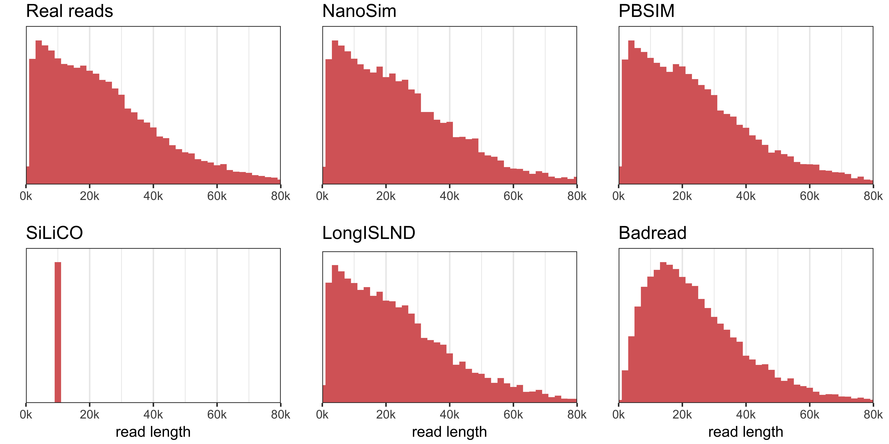
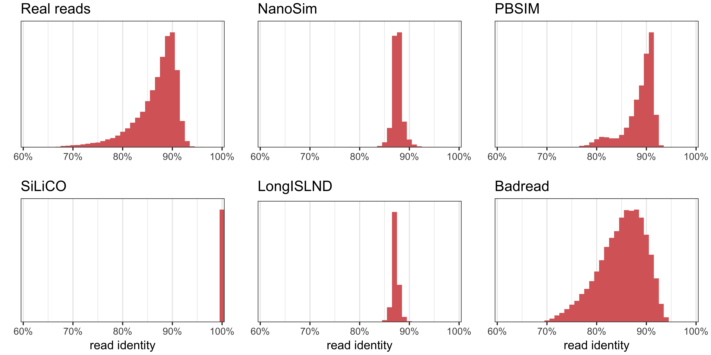
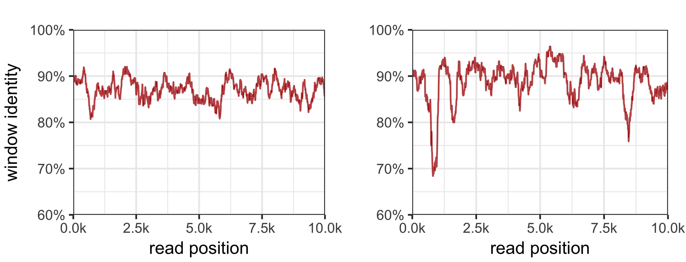
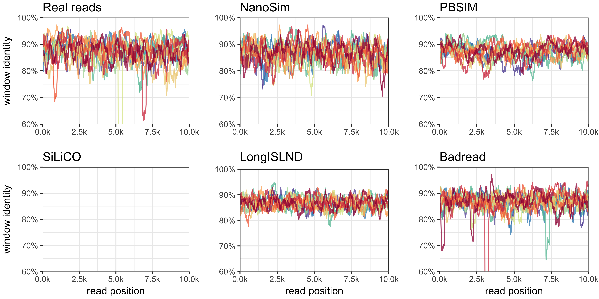
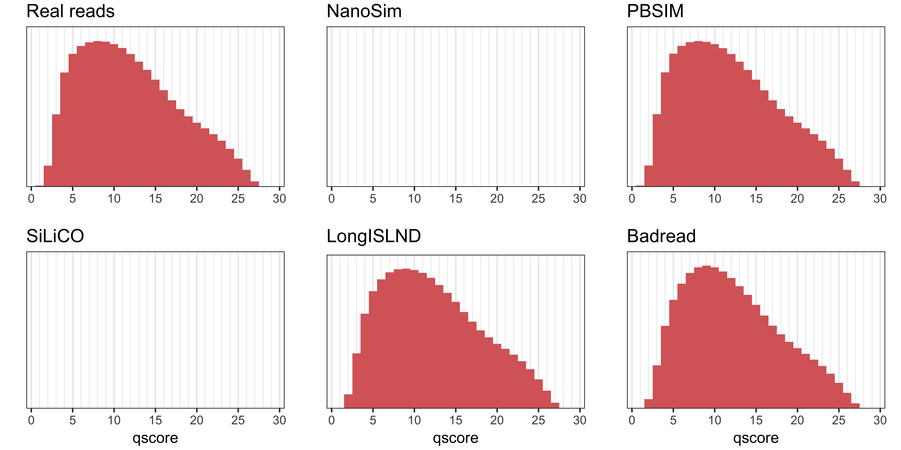
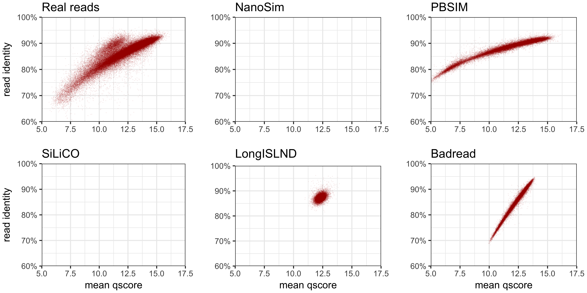
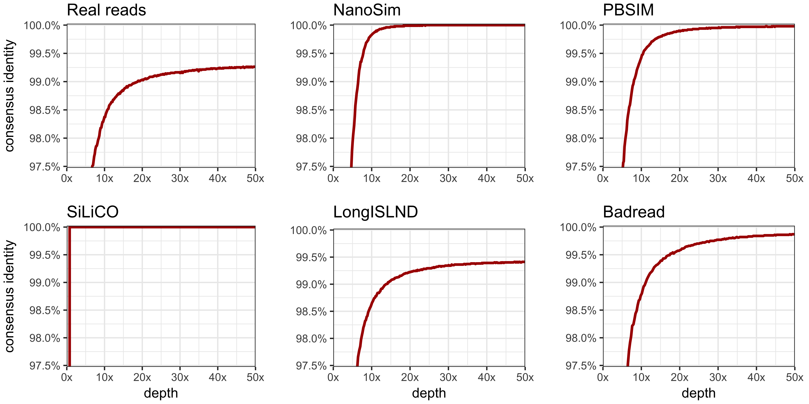

# Comparison to real reads and other simulators

* [Simulators tested](#simulators-tested)
* [Real read set](#real-read-set)
* [Training commands](#training-commands)
* [Simulation commands](#simulation-commands)
* [Results](#results)
    * [Read lengths](#read-lengths)
    * [Read identities](#read-identities)
    * [Identities across reads](#identities-across-reads)
    * [Qscore distribution](#qscore-distribution)
    * [Read identity vs mean qscore](#read-identity-vs-mean-qscore)
    * [Consensus accuracy](#consensus-accuracy)
* [Conclusions](#conclusions)


## Simulators tested

This comparison includes the following four long-read simulators:
* [Badread](https://github.com/rrwick/Badread) v0.1.0
* [NanoSim](https://github.com/bcgsc/nanosim) v2.1.0
* [PBSIM](https://github.com/pfaucon/PBSIM-PacBio-Simulator) v1.0.3
* [LongISLND](https://github.com/bioinform/longislnd) v0.9.5

I was also interested in [loresim2](https://github.com/gt1/loresim2) but couldn't get it to compile, and I excluded [SiLiCO](https://github.com/ethanagbaker/SiLiCO) because (at least in my tests) it only produced reads of 100% identity.


## Real read set

I used a Nanopore MinION run on [this sample](https://www.ncbi.nlm.nih.gov/biosample/SAMEA3356997) as my real read set to compare against. It's a _Klebsiella pneumoniae_ genome about 5.5 Mbp in size. There are 115,042 reads which have a total size of 1.1 Gbp (200x depth) and an N50 read length of 21.1 kbp. The completed genome (a hybrid Illumina + Nanopore assembly) is `ref.fasta` in the commands below.

This is a slightly older sample from early 2017, so I redid the basecalling with a more recent version of Albacore (v2.3.1). I chose this sample because it was not part of a barcoded run – only the one genome was sequenced in its run. This means it should contain the full spectrum of read quality, unlike for a barcoded sample where the demultiplexing process removes many of the lower quality reads.


## Training commands

Some read simulation tools can be trained for a more realistic model. Wherever possible, I used the real reads to train the simulators.

#### Badread:
```
minimap2 -t 32 -c -x map-ont ref.fasta real_reads.fastq.gz > alignments.paf
badread error_model --reference ref.fasta --reads real_reads.fastq.gz --alignment alignments.paf > badread_errors
badread qscore_model --reference ref.fasta --reads real_reads.fastq.gz --alignment alignments.paf > badread_qscores
```

#### NanoSim:
```
seqtk seq -A real_reads.fastq.gz > real_reads.fasta
read_analysis.py -i real_reads.fasta -r ref.fasta
```

#### LongISLND:
```
gunzip -c real_reads.fastq.gz > real_reads.fastq
minimap2 -a -x map-ont -t 16 ref.fasta real_reads.fastq.gz | samtools view -hu - | samtools sort -@ 4 -o real_reads.fastq.bam -
samtools index real_reads.fastq.bam
samtools faidx ref.fasta
sample.py --input_suffix fastq.bam --read_type fastq --model_dir longislnd_model --reference ref.fasta
```

PBSIM also uses a real read set, but in the simulation command (see below).


## Simulation commands

While the sample genome has two plasmids, I chose to use only the chromosome for a simulation reference. This kept things simpler and allowed me to use NanoSim in [circular mode](https://github.com/bcgsc/NanoSim#2-simulation-stage):
```
seqtk seq ref.fasta | head -n 2 > ref_chromosome.fasta
```

I mostly used each tool's default parameters when simulating reads. The specific commands used are below:

#### Badread
``` 
badread simulate --quantity 100x --reference ref_chromosome.fasta --error_model badread_errors --qscore_model badread_qscores | gzip > badread_reads.fastq.gz
```

#### NanoSim
```
simulator.py circular -r ref_chromosome.fasta -c training -n 55000
gzip -c simulated_reads.fasta > nanosim_reads.fasta.gz
rm simulated_reads.fasta simulated.log simulated_error_profile
```

#### PBSIM
```
gunzip -c real_reads.fastq.gz > real_reads.fastq
pbsim --data-type CLR --depth 100 --sample-fastq real_reads.fastq --length-max 1000000 --accuracy-min 0 ref_chromosome.fasta
gzip -c sd_0001.fastq > pbsim_reads.fastq.gz
rm real_reads.fastq sd_0001.ref sd_0001.maf sd_0001.fastq
```

#### LongISLND
```
simulate.py --movie_id ONT --read_type fastq --model_dir longislnd_model --fasta ref_chromosome.fasta --coverage 100
cat out/*.fq | gzip > longislnd_reads.fastq.gz
rm -r out
```


## Results

I've analysed the read sets to qualitatively compare them against each other and against the real read set (in the top left of each plot). For each analysis, a good result is one that closely mimics the nature of the real read set.


### Read lengths

<p align="center"></p>

These plots show the distribution of read lengths in histogram form. The values are weighted by the read length, so these are actually distributions of _bases_ in reads (e.g. a 40 kbp read contributes 10x as much as a 4 kbp read), which I find to be more useful than simple distributions of read counts. The read N50 is the median of these distributions.

NanoSim, PBSIM and LongISLND all sample from the real read length distribution, so their distributions matched the real reads very well. Badread generates its read lengths from a gamma distribution, so it was not as realistic.


### Read identities

<p align="center"></p>

Read identity was determined by aligning each read back to the reference genome from which it was made. Both NanoSim and LongISLND produced narrow identity distributions – i.e. all reads were similarly accurate. PBSIM's distribution was wider but still lacked many reads below about 75% identity. Only Badread covered the entire identity spectrum, with plenty of reads down to 70% identity and below. Its mean identity was actually worse than the real read set, but after all it is called <em>Bad</em>read.


### Identities across reads

These plots may take a bit more explaining, so here are two examples showing read identity over a 250 bp sliding window across 10 kbp regions of a read:

<p align="center"></p>

Both of the above examples have an overall identity of 87.5%, but the read on the left is more even – every one of its 250 bp windows stays within 80–92.5%. The read on the right is more variable with higher highs and lower lows.

With those examples in mind, here are plots showing 10 reads from each set. Again, these reads all have an average identity of 87.5% (I chose that value because all simulators produced reads in that range):

<p align="center"></p>

The real reads had a moderate amount of variance from their mean identity. NanoSim looked pretty good here, largely matching the pattern of the real reads. Both PBSIM and LongISLND made reads that were a bit too even.

The real reads contained some 'glitches' – junky regions in which the window identity drastically dropped. Badread was the only simulator which also included glitches. It actually included _more_ glitches than the real reads, but again, that's why it's called <em>Bad</em>read.


### Qscore distribution

<p align="center"></p>

NanoSim outputs reads in FASTA format (which lack qscores) and so was excluded from this plot and the following plot. The other simulators all model their qscores using real reads, and each achieved a very realistic looking distribution.


### Read identity vs mean qscore

<p align="center"></p>

Each point in these plots represents one read. Mean qscore should be positively correlated with read identity, i.e. qscores are informative about the quality of the read. While this was true for the real reads, they had a bimodal distribution with some reads appearing higher on the plot (more accurate than their qscore suggested) – I'm not sure what caused this behaviour.

PBSIM and Badread did best here, but neither quite matched the real read set. PBSIM's mean qscores tended to be too low, while Badread's mean qscores didn't span the full range. Both PBSIM and Badread had unrealistically tight correlations. LongISLND's narrow identity distribution made it difficult to assess, but the correlation looked weak.


### Consensus accuracy

<p align="center"></p>

These plots show the assembly accuracy (specifically, a [Rebaler](https://github.com/rrwick/Rebaler) assembly which uses [Racon](https://github.com/isovic/racon) to polish) as a function of read depth. Note that the real read assembly never achieved a particularly high accuracy due to systematic basecalling errors (mainly getting homopolymer lengths wrong and botching locations with modified bases).

NanoSim and PBSIM approached 100% assembly accuracy, showing that they did not model these systematic errors very well. LongISLND's assemblies had the lowest accuracy of the simulated reads, suggesting that it did a better job of modelling the read errors. Badread was middle-of-the-pack in this regard, approaching 100% accuracy but at a higher depth.


## Conclusions

None of the simulators excelled in every category – i.e. each produced reads which could be distinguished from real reads. That being said, PBSIM was a very good all-rounder, despite being the oldest tool tested (developed in 2012), and it was also very fast to run. NanoSim was best at varying identity across the length of a read, and LongISLND seemed to be best at modelling systematic basecalling errors. Badread (true to its name) was best at modelling many read problems, like glitches and low identities.

I didn't make Badread with the intention of simulating reads as realistically as possible. Rather, Badread strives to give users control over various long-read faults, so they can torture-test tools which take long reads as input. That being said, a few tweaks to its parameters (like tightening up the read identity distribution) could make it pretty good at imitating real Nanopore reads.
